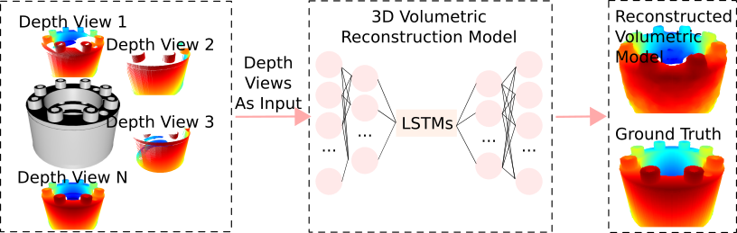

# R-GAN
Getting 3D volumetric information for an object is essential in applications ranging from autonomous manufactur- ing to robotic scene perception. In order to get 3D volumetric information for an object, RGB-D sensors are widely used to capture depth information. To reconstruct 3D volumetric infor- mation of an object, this paper designed an extended generative adversary network (GAN) with a recurrent generator. The model can take a single or a sequence of depth scans of an object to reconstruct the 3D volumetric model of the object. In precise, 3D long short-term memory (LSTM) units that are employed in the generator can extract features from the sequence of depth scans in different time steps. The reconstructed results of the proposed model are evaluated by calculating intersection over union (IoU) in both 3D space and 2D projection. The model achieved 77.71% in IoU, 80.08% in hit rate, and 97.45% in accuracy, which outperformed other methods.

Some 3D Reconstruction Results are shown below. 
#### Brake ####
https://user-images.githubusercontent.com/32248581/180898077-9396c48d-c1a2-405b-a83f-e166bc38de78.mp4
#### Fastener ####
https://user-images.githubusercontent.com/32248581/180898104-34c806da-9bac-4342-a155-c717eed4bd81.mp4
#### Handle ####
https://user-images.githubusercontent.com/32248581/180898120-127653c9-9000-4efc-84d6-a54303c5cde6.mp4
#### Linear and Rotary Motion ####
https://user-images.githubusercontent.com/32248581/180898149-3b0750a2-184d-452b-af5f-ba1fc6817aaf.mp4
#### Power Transmition ####
https://user-images.githubusercontent.com/32248581/180898236-3708a73e-9408-43ea-b83c-7c566e0f62e7.mp4
#### Sealing ####
https://user-images.githubusercontent.com/32248581/180898253-6c6647a0-45c8-4d45-a582-dfb1d10031ea.mp4

